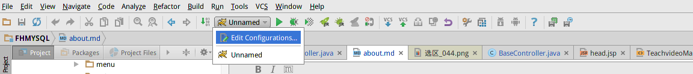
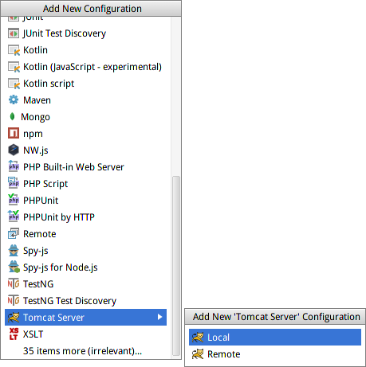
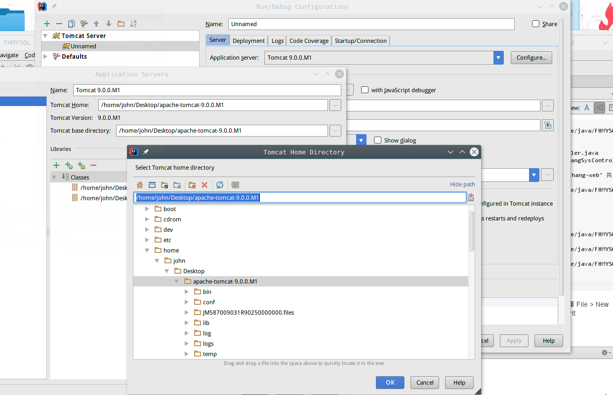
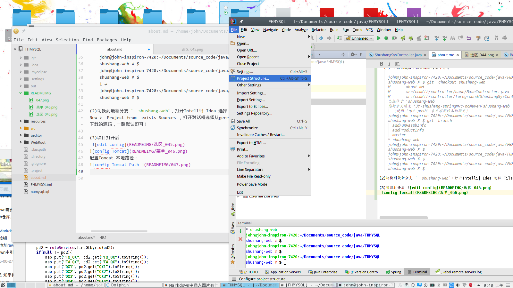
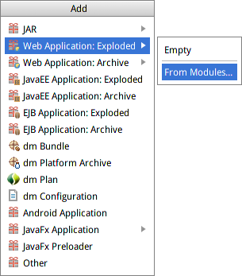
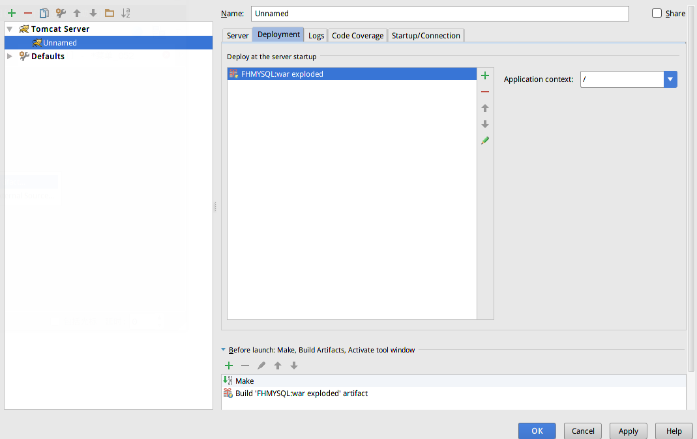

http://www.bkjia.com/webzh/1001016.html  修复ueditor  文件传输

后期 功能 增加及其完善 ，都 在本分支发布 创建！

--------

本程序部署文档
=====
1.下载

	项目git地址：git clone ssh://yaojie@139.196.49.110:29418/JY-shushang-springmvc-noMaven
	Tomcat下载：http://tomcat.apache.org/download-90.cgi
	Intellij Idea 下载：https://www.jetbrains.com/idea/download/#section=linux
	Intellij Idea激活：https://www.jetbrains.com/idea/download/#section=linux

2.部署：

  (1) 下载完成后，在终端运行如下命令

	john@john-inspiron-7420:~/Documents/source_code/java/FHMYSQL
    shushang-web ✗ $ git  checkout shushang-web
    M       about.md
    M       src/com/fh/controller/base/BaseController.java
    M       src/com/fh/controller/foreground/ShushangSysController.java
    已经位于 'shushang-web'
    您的分支领先 'JY-shushang-springmvc-noMaven/shushang-web' 共 4 个提交。
      （使用 "git push" 来发布您的本地提交）
    john@john-inspiron-7420:~/Documents/source_code/java/FHMYSQL
    shushang-web ✗ $ git  branch
      addFunRaspbInfo
      addProductInfo
      master
    * shushang-web
    john@john-inspiron-7420:~/Documents/source_code/java/FHMYSQL
    shushang-web ✗ $
    john@john-inspiron-7420:~/Documents/source_code/java/FHMYSQL
    shushang-web ✗ $                                                                                                                                                                        1 ↵
    john@john-inspiron-7420:~/Documents/source_code/java/FHMYSQL
    shushang-web ✗ $

(2)切换到最新分支 `  shushang-web`，打开Intellij Idea 选择 File > New >  Project from  exists Sources ，打开对话框选择从gerrit 下载的源码，一路默认即可！

(3)项目打开后
 

配置Tomcat 本地路径：

配置部署工程：

选择 Artifacts >

选择ok后，

一切就绪，返回主界面：

3.部署数据库：
* 安装 mysql 数据库略。
* 在工程根目录下 有个数据库脚本`numysql.sql`文件，选择任意数据库管理工具将数据导入数据库，这里介绍 命令行操作
	+ mysql -u  ‘你的数据库用户名’ -p '数据库密码'
	+ 正确进入后 执行 `mysql root@localhost:(none)> source /path/to/sql/source_code/java/numysql.sql;
`
4.运行本程序：

绿色按钮

5.登陆用户名密码：
 user： admin
 pwd： 1

 /： http://localhost:8080/shushang/showAll

 后台：http://localhost:8080

| user     		|pwd    						 |
| :------------- :| :-------------:|
| admin       | 1     |
| john    	  | 1     |

---------
数据库导入：
 win or  linux ：  mysqldump  -uroot  -pxxxx  dbname < dbname.sql

先进入数据库：